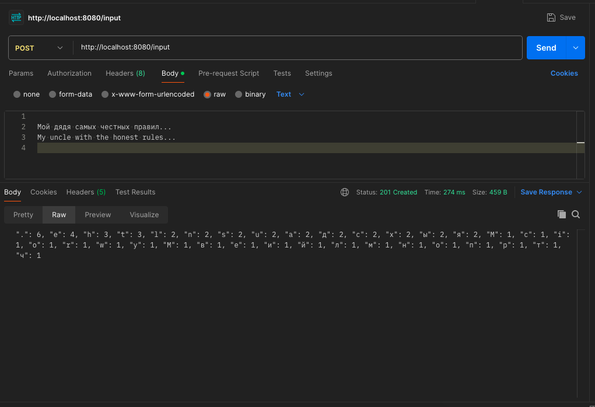

# Приложение - вычисление повторяемости символов в строке

## Welcome!

Используются REST запросы

## Используемые технологии:

* Java 17

* Spring Boot (v3.2.2)

* Maven

### 1. Запуск приложения с maven.
Перейдите в корень проекта через командную строку и выполните команды:

```
mvn clean install
```

```
mvn spring-boot:run
```

Теперь можно отправить REST запрос (через -curl или PostMan)

Запрос не надо оборачивать ни в какой формат, просто наберите строку под обработку:


И появится результат

## Have a good job!